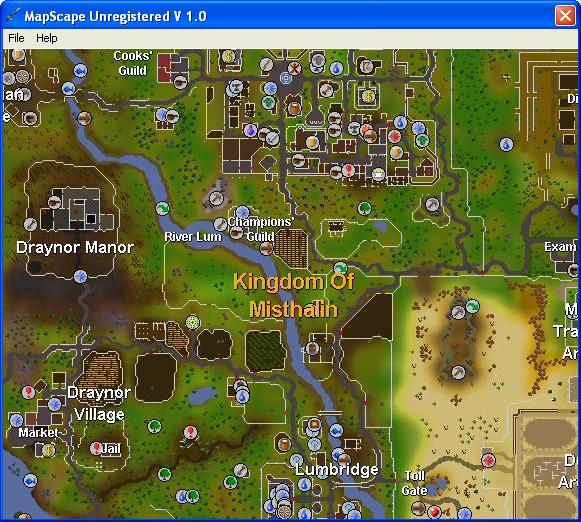



## Map Scape

### Description

My App takes the Runescape world map and displays it. You can move the map around with the W A S D keys. This is 100% my code. I thought of it myself.
 
### More Info
 
You can move the map around with the W A S D keys.

You can save the world map as a file

When you save the world map, it saves to about 40 MB.

             |
---                |---
**Submitted On**   |2006-12-27 19:39:00
**By**             |[Eric mrE521](https://github.com/Planet-Source-Code/PSCIndex/blob/master/ByAuthor/eric-mre521.md)
**Level**          |Intermediate
**User Rating**    |5.0 (15 globes from 3 users)
**Compatibility**  |VB 4\.0 \(32\-bit\), VB 5\.0, VB 6\.0
**Category**       |[Games](https://github.com/Planet-Source-Code/PSCIndex/blob/master/ByCategory/games__1-38.md)
**World**          |[Visual Basic](https://github.com/Planet-Source-Code/PSCIndex/blob/master/ByWorld/visual-basic.md)
**Archive File**   |[Map\_Scape20401412312006\.zip](https://github.com/Planet-Source-Code/eric-mre521-map-scape__1-67519/archive/master.zip)

